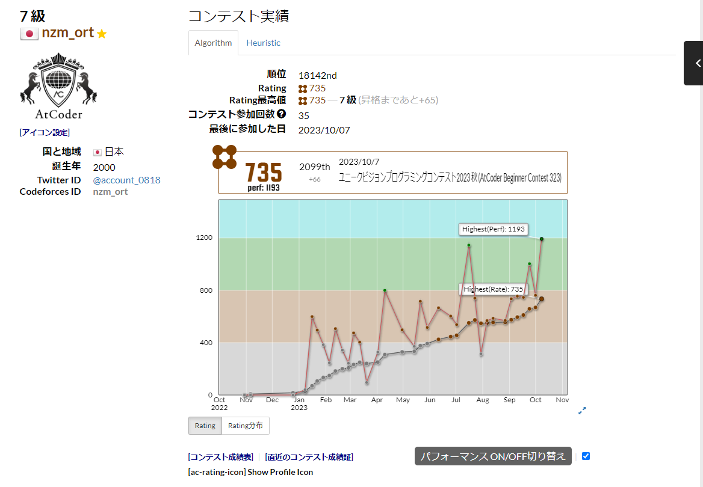

<h1>AtCoder Perf Graph(ユーザースクリプト)</h1>
<h3>インストール先URL：<a href="https://greasyfork.org/ja/scripts/476103-atcoder-perf-graph">https://greasyfork.org/ja/scripts/476103-atcoder-perf-graph</a></h3>

<ul>
    <li><a href="https://atcoder.jp/?lang=ja">AtCoder</a>マイページのレーティンググラフにパフォーマンスグラフを重ねて表示します。 </li>
    <li>「パフォーマンスON/OFF切り替えボタン」を押すことでパフォーマンスグラフの表示非表示を切り替えできます。</li>
</ul>
 
 
 
<h1>機能</h1>
<ul>
    <li>パフォーマンスグラフの描画</li>
    <li>ホバー時した点でのパフォーマンス表示</li>
    <li>Highest(Perf)(=過去最高パフォーマンス)の表示</li>
    <li>パフォーマンスグラフの表示非表示切り替えボタン</li>
</ul>
 
<h1>補足</h1>
<ul>
    <li>うまく表示されない場合は、リロードしてください。</li>
</ul>
 
<h1>参考</h1>
<ul>
    <li><a href="https://atcoder.jp/?lang=ja">AtCoder</a></li>
    <li><a href="https://kenkoooo.com/atcoder/#/table/">AtCoder Problems</a></li>
    <li><a href="https://greasyfork.org/ja/scripts/416588-atcoderdevotiongraph">AtCoderDevotionGraph</a></li>
</ul>